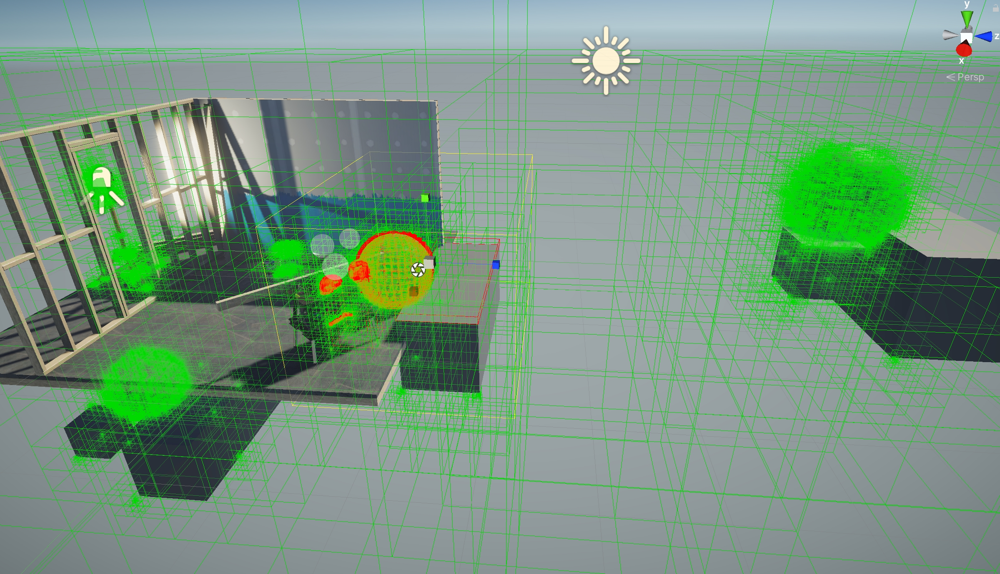
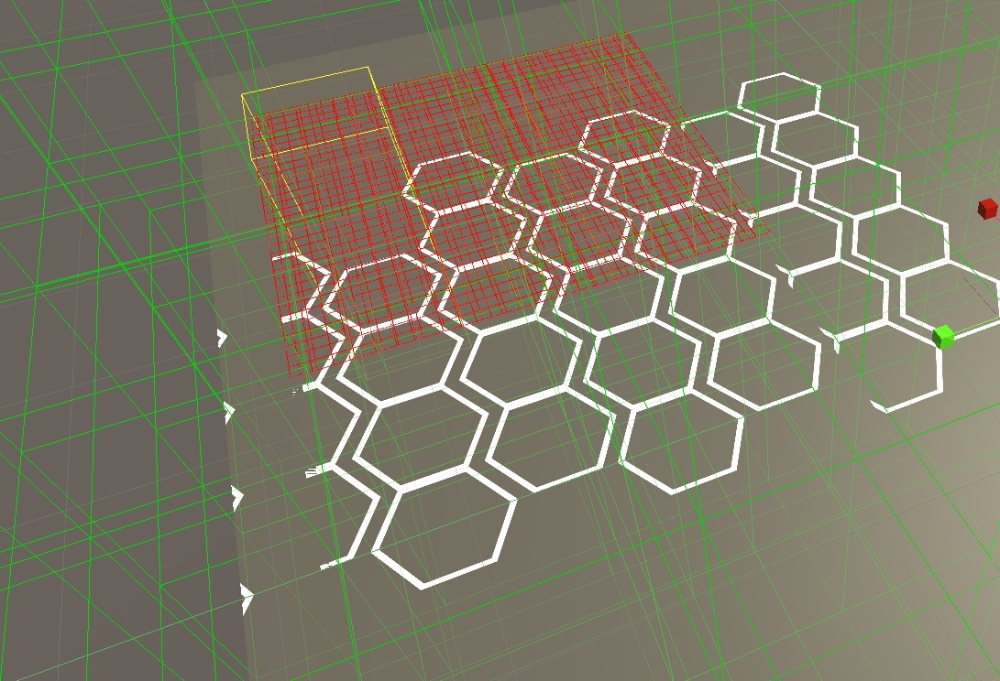
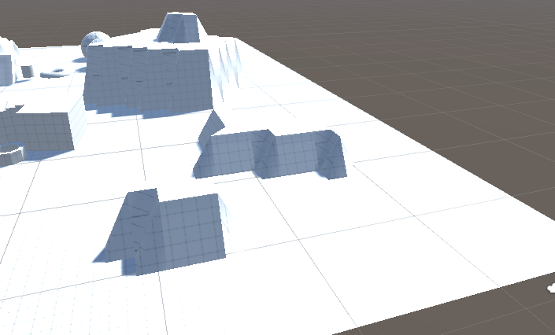
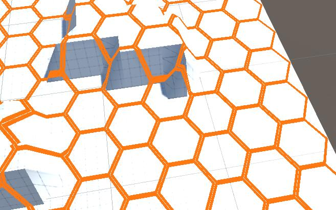

# HexMap

### 需求
想要在一个正常现成场景中生成HexMap，能完全贴合与场景之上，并能单独管理每个单元，于是有了这个技术测试。

### 原理
* 用八叉树管理场景的所有三角面，用层级区分目标的物体
* 利用`Projetor Bounds`检测范围的三角面，并生成对应的模型
* 动态排版`Projector Bounds`重复生成模型
* 利用`FBX Exporter`导出模型文件

### 展示
  
  
  
  

### TODO
- [ ] HexMap模型优化
- [ ] HexMap管理，碰撞检测
- [ ] DrawCall优化